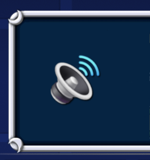

# GDPopupSounds
A mod that adds error and popup sounds.



*Geode Devs: Update logo.png to change your mod's icon (please)*
*Me: no :D*

## How to install
1. ~~Install with geode or import the .geode file.~~
2. Manual build (see below)

## Build instructions

```
# Assuming you have the Geode CLI set up already, run this in a fork in VSCode or workspace.
geode build
```
